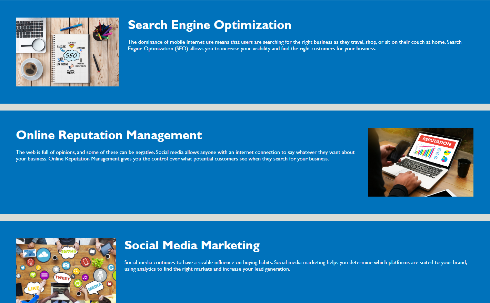

# Horiseon Landing Page

## Description 

The Horiseon Landing Page focuses on providing users with information in relation to the services offered by Horiseon.

The page is designed to be visually efficient to navigate and easily navigated through screen-readers.

The information about the services provided is clearly highlighted and the main content of the services on offer are clearly defined:

The main content of the page is separated from the card representing the values which can be found on the right side of the page:

## Installation

***N/A***

## Usage 

This page is meant to provide information about Horiseon. The page is simply laid out and no additional steps are required in its usage.

The user is able to navigate quickly between the cards (**Search Engine Optimization** | **Online Reputation Management** | **Social Media Marketing**) via the links bearing the same  names located in the top-left side of the landing page.

## Credits

***N/A***

## License

**MIT**

